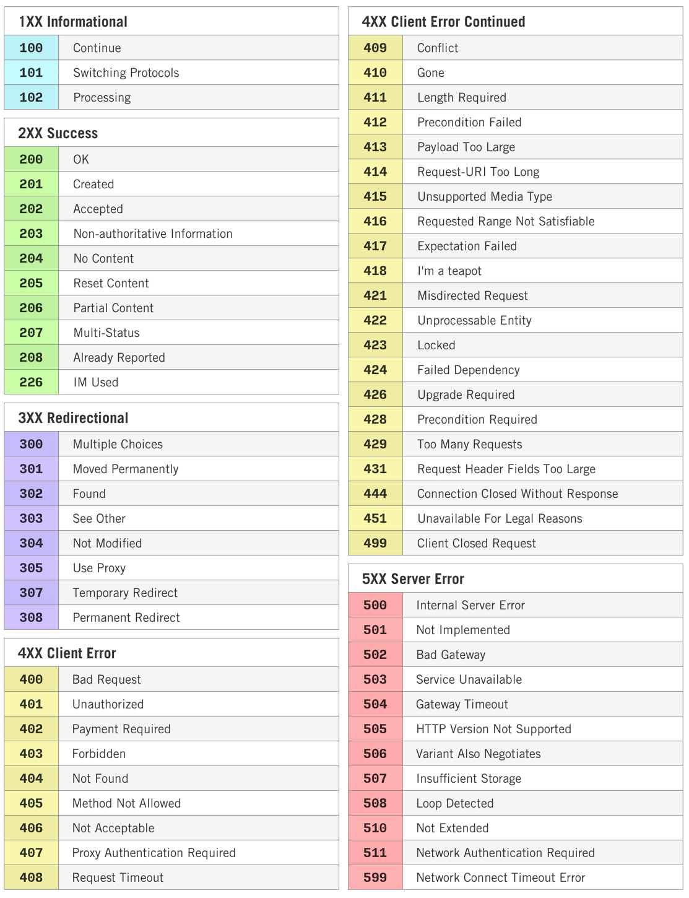
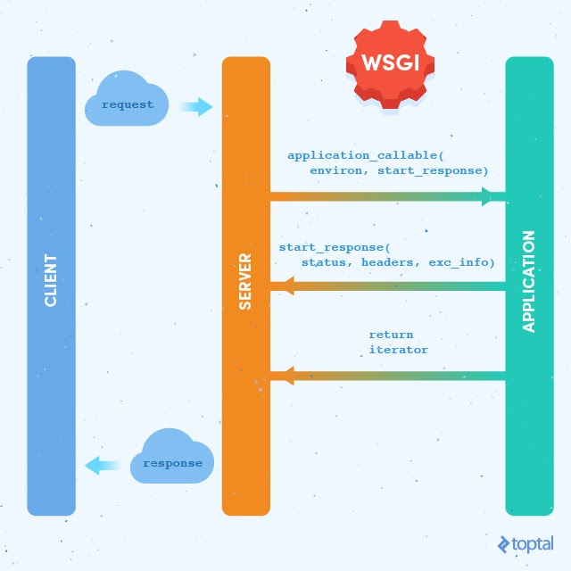

# Curso CodeShow

#### Desenvolvimento web com Python e Flask

https://codeshow.com.br

https://twitch.tv/codeshow


Olá seja bem vindo ao Curso de Python e Flask do Codeshow meu nome é **Bruno Rocha** no twitter, github e outras redes meu nickname é `@rochacbruno` e meu site http://brunorocha.org 


Quero te convidar para se inscrever nos meus canais:

http://YouTube.com/CodeShowBR

https://twitch.tv/codeshow


Entrar no Discord: https://discord.io/codeshow ou no grupo do telegram: https://t.me/codeshowbr 


Os códigos deste tutorial estão em http://github.com/codeshow/curso-flask 


> Este trabalho está licenciado com uma [Licença Creative Commons - Atribuição-NãoComercial-CompartilhaIgual 4.0 Internacional](https://creativecommons.org/licenses/by-nc-sa/4.0/).


#### Agradecimentos:


Toda a comunidade **Live Coders do Brasil** e principalmente a **Karla Magueta** e **Erik Rocha Magueta Soler**.


Para começar vamos **alinhar** as **expectativas!**


## O objetivo deste tutorial

* Apresentar conceitos de HTTP e Web
* Apresentar sugestões para arquitetura de um Projeto Flask
* Mostrar erros comuns a serem evitados no Flask
* Praticar a utilização de Factories, Blueprints e Extensões
* Utilizar as principais extensões do Flask
* Desenvolver uma aplicação web de exemplo para gestão de entregas


## Desenvolveremos

* Aplicação Flask com factory pattern
* Interface CLI com o flask.cli
* Acesso a banco de dados
* Tarefas de segundo plano
* Criação de Blueprints
* Web UI com formulários wtforms e templates Flask-bootstrap
* Interface Admin
* Autenticação
* Rest API
* Testes da REST API
* Deploy

**O que não veremos: (importante para otimizar o tempo)**

* Uso avançado front-end (faremos o básico mas o foco é o backend)


**Notas importantes:**


* Durante o tutorial responderei perguntas rápidas, mas se perceber que a pergunta foge do foco do tutorial não será prontamente respondida mas poderemos conversar a respeito no grupo do discord.
* O objetivo deste tutorial é ensinar os conceitos e **não desenvolver o aplicativo completo**, portanto algumas coisas serão simplificadas e caso não dê tempo de terminar o desenvolvimento completo do aplicativo não tem problema! o importante é fixar os conceitos principais de arquitetura com Flask.

## Ementa


[Parte 0: HTTP, Web e WSGI](#parte-0-http-web-e-wsgi)

[Parte 1: Estruturando a base do projeto Flask](#parte-1-estruturando-a-base-do-projeto)

[Parte 2: A linha de comando e o `Flask` CLI]()

[Parte 3: Extensões e Banco de dados]()

[Parte 4: View e processamento de Formulário usando Blueprint]()

[Parte 5: A interface administrativa com Flask Admin]()

[Parte 6: REST API]()

[Parte 7: Protegendo o app com login/senha]()

[Parte 8: Testando a API]()

[Parte 9: Deploy]()

## Parte 0: HTTP, Web e WSGI

### HTTP


> “O protocolo HTTP define métodos (às vezes referidos como verbos) para indicar a ação desejada a ser realizada no recurso identificado. O que este recurso representa, se são dados pré-existentes ou dados gerados dinamicamente, depende da implementação do servidor. Muitas vezes, o recurso corresponde a um arquivo ou a saída de um executável residente no servidor.” (fonte [Wikipedia](https://en.wikipedia.org/wiki/Hypertext_Transfer_Protocol#Request_methods))


Em resumo, os verbos HTTP são os métodos de requisição que utilizamos para acessar as **URLs** de recursos servidor por um programa rodando na web.


Uma das primeiras coisas que deve ser feita ao iniciar um projeto web é planejar os recursos que existirão para o acesso aos dados e para as ações específicas.


**Exemplo:**

| Endpoint      | Método | Ação                                              |
|---------------|--------|---------------------------------------------------|
| `/users`      | GET    | Retorna a lista de usuários                       |
| `/users`      | POST   | Insere um novo usuário                            |
| `/users/{id}` | GET    | Retorna o usuário com `id = {id}`                 |
| `/users/{id}` | PUT    | Substitui os dados do usuário com `id = {id}`     |
| `/users/{id}` | PATCH  | Altera items dos dados do usuário com `id = {id}` |
| `/users/{id}` | DELETE | Remove o usuário com `id = {id}`                  |


Um browser como Chrome ou Firefox por exemplo, fazem a requisição a um site utilizando o verbo **GET** e ao submeter um formulário de cadastro utiliza o verbo **POST**. Os outros verbos desta lista são mais utilizados em APIs REST.

Ao usar um verbo **HTTP** para requisitar um recurso o servidor responde com os cabeçalhos (headers), o body (conteúdo) e um código de status.


### Lista de códigos de status




**Exemplo de Verbos e seus principais códigos de retorno:**

| VERBO  | CRRUD   | Retorno esperado        |
|--------|---------|-------------------------|
| POST   | Create  | 201 (created), 409, 50x |
| GET    | Read    | 200 (Ok), 204, 404, 500 |
| PUT    | Replace | 200, 201, 409, 404, 50x |
| PATCH  | Update  | 200, 201, 409, 404, 50x |
| DELETE | Delete  | 200, 404, 50x           |


#### Clientes HTTP


Toda vez que você acessa um site usando o navegador está utilizando um cliente HTTP, todos os navegadores web como Chrome, Firefox, Opera etc são clientes que tem como principal objetivo requisitar informações de um servidor web e renderizar o conteúdo na sua tela.


Mas além dos navegadores é muito comum utilizarmos clientes HTTP programáticos para acessar recursos de um servidor.


**Exemplos:**

**DICA:** Para testar requisições utilize o https://httpbin.org/


**cURL:**


```shell
$ curl -X POST "https://httpbin.org/post" -H "accept: application/json" -d "{'id': 5, 'name': 'foo', 'category': 'bar'}"
....
Response 201 Created
{
   "msg": "Produto inserido com sucesso",
  "product": "/product/5"
}
```


**Python requests:**


```python
>> r = requests.get('https://httpbin.org/get', auth=('user', 'pass'))
>>> r.status_code
200
>>> r.headers['content-type']
'application/json; charset=utf8'
```


**Front-End (HTML/CSS/JS)**


Em um navegador ou aplicativo móvel tudo o que é possível ver ou interagir através da tela é de responsabilidade da camada de front-end onde são usadas a linguagem de **marcação HTML**, a linguagem de **estilos CSS** e a linguagem de **programação Javascript**.


**HTML**


A estruturação dos componentes (botões, textos, links, etc) na tela são feitas com a linguagem de marcação HTML, a linguagem HTML é estruturada através de **tags** que determinam apenas a estrutura e a semântica do documento.

**Exemplo:**


```html
<html>
<head>
  <title>Hello</title>
</head>
<body>
  <h1>Titulo do meu site!</h1>
  <button id="btn1">Clique aqui</button>
</body>
</html>
```


Resultado no navegador:


**CSS**


Para dar estilo ao site utilizamos a linguagem de estilos CSS (Cascading Style Shets) e com ela podemos definir propriedades como cores, fontes, tamanhos entre outros aspectos visuais e também fazer alguns tipos de animação. o CSS utiliza seletores do DOM (Document Object Model) para acessar os componentes criados com HTML e aplicar estilo a eles.

**Exemplo:**


```css
h1 {
  color: red;
  text-decoration: underline;
}

button#btn1 {
  color: green;
  background-color: #ffcc00;
  font-size: 23px;
  font-weight: bold;
  border-radius: 35%;
}
```


Resultado no navegador:


**NOTA:** Você já deve ter percebido que eu não tenho muitos talentos para design de front-end (minha especialização é no back-end), mas não se preocupe! durante este curso usaremos frameworks CSS que já trazem os componentes prontos e estilizados e as coisas ficarão mais bonitinhas!


**JS**

Javascript é a linguagem de programação que é interpretada pelos navegadores e podemos utilizar ela para adicionar comportamento aos nossos componentes HTML, existem várias maneiras de adicionar Javascript a um componente HTML e durante este treinamento usaremos um framework JS para facilitar as coisas, mas aqui vai um exemplo bem básico.

**Exemplo:**


```javascript
// pegamos o elemento botão  através do seu id="btn1"
var button = document.getElementById('btn1')
// Adicionamos a chamada a uma função quanto o botão for clicado
button.addEventListener("click", function() {alert('Hello')});
```


Resultado ao clicar no botão:


Para ver este exemplo em execução e alterar o código clique em: https://skip.gg/exemplo-codeshow-html-css-js


**Back-end (WSGI, Serviços e bancos de dados)**


O Web Server Gateway Interface (WSGI), em português Interface de Porta de Entrada do Servidor Web, é uma especificação para uma interface simples e universal entre servidores web e aplicações web ou frameworks para a linguagem de programação Python.





**Exemplo de um programa WSGI puro**


```python
def application(environ, start_response):
    body = b'Hello world!\n'
    status = '200 OK'
    headers = [('Content-type', 'text/plain')]
    start_response(status, headers)
    return [body]
```

Para executar o programa cima é preciso um servidor WSGI instalado exemplo:


```
gunicorn arquivo:application
```


ou no final do arquivo.py incluir o servidor wsgiref embutido do Python


```python
if __name__ == "__main__":
    from wsgiref.simple_server import make_server
    make_server('0.0.0.0', 8000, application).serve_forever()
```


**Programa WSGI usando o Python HTTP Server**


```python
from http.server import HTTPServer, BaseHTTPRequestHandler


class Index(BaseHTTPRequestHandler):
   def do_GET(self):
       self.send_response(200)
       self.send_header("Content-Type", "text/html")
       self.end_headers()
       self.wfile.write("<h1>Hello World</h1>".encode("utf-8"))


app = HTTPServer(("0.0.0.0", 8000), Index)
app.serve_forever()
```

### Exemplo de acesso a banco de dados SQL

```sql
import sqlite3
conn = sqlite3.connect('loja.db')
cursor = conn.cursor()
cursor.execute("""CREATE TABLE produtos (
id INTEGER NOT NULL PRIMARY KEY AUTOINCREMENT,
nome TEXT NOT NULL
);""")
cursor.execute("INSERT INTO produtos (nome) VALUES ('Cadeira')")
conn.commit()
conn.close()
```

## Parte 1: Estruturando a base do projeto

Um aplicativo básico no flask pode ser feito de maneira bastante simples com apenas 5 linhas de código:


`app.py` é o nome de arquivo onde geralmente escrevemos o ponto de entrada da aplicação Flask.


```python
from flask import Flask
app = Flask(__name__)
@app.route('/')
def index():
    return "Hello World"
```


O problema é que quando o projeto começa a crescer vamos nos deparar com uma série de problemas e precisamos pensar em como evitá-los.


Um desses problemas é conhecido como **circular imports** e acontece quando começamos a dividir nosso projeto em múltiplos arquivos e módulos que tornam-se interdependentes.


**Exemplo:**

No `app.py`

```python
from flask import Flask
from views import index
app = Flask(__name__)
```

E então no `views.py`

```python
from app import app
@app.route('/')
def index():
    return "Hello World"
```


O problema acontece pois um módulo está tentando importar o outro e entrando em dependência cíclica, conhecida também como circular import ou deadlock.


Para resolver o problema de circular imports uma das abordagens adotadas é alterar a ordem dos imports no `app.py`


```python
from flask import Flask
app = Flask(__name__)
from views import index
```


Porém isto torna o código **feio**, difícil de manter e fere a legibilidade.


A melhor forma de resolver este problema é com a aplicação do padrão **application factory** e **Blueprints** que será discutido adiante.


### Flask Lifetime

Um outro problema comum encontrado ao interagir com aplicações Flask ocorre por conta da falta de entendimento dos contextos da aplicação Flask. E dominar o Flask está diretamente relacionado ao entendimento desses **3 estados** da aplicação Flask.


**1) Contexto de Configuração:**


Um objeto Flask `app` assim que é instanciado com `app = Flask(__name__)`  entra no que chamamos de **contexto de configuração**, nesta fase o aplicativo ainda não tem informações suficientes a respeito do ambiente em que está sendo executado, ele não sabe se está rodando em um servidor web e não tem informações completas sobre quais configurações e extensões estão registradas e é o momento em que podemos construir a aplicação através do uso de factories.


Esta fase é importantíssima pois é nesse momento que podemos registrar rotas e views, registrar blueprints, carregar extensões e mudar parâmetros de configuração do Flask.


**O que podemos fazer durante o contexto de configuração?**


Adicionar configurações


```python
app.config['FOO'] = 'bar'
```


Registrar views


```python
@app.route('/")
app.add_url_rule('/', ....)
```


Fazer composição e injetar dependências


```python
app.add_template_global(function)
```


Registrar blueprints


```python
app.register_blueprint(foobar)
```


Iniciar extensões


```python
admin = Admin(app)
```


Registrar hooks


```python
@app.before_request(...)
@app.error_handler(...)
```


Passar o `app` como parâmetro em factory functions


```python
views.configure(app)
extensions.configure(app)
```


2) Contexto de aplicação


Com a aplicação executada (sendo servida por um web server) assim que uma requisição chega ao web server (ex: um usuário digita a URL no navegador ou clicar em um botão) o web server então direciona este pedido ao aplicativo que está em execução e uma nova thread de processamento é iniciada para ser utilizada especificamente neste request (**thread locals**) e o objeto Flask residente desta thread é uma app em estado de Aplicação `Application Context`.


Essa separação de contexto é bastante importante pois é apenas nessa fase que podemos usar objetos compartilhados bastante úteis como `current_app` e o objeto global `g`. Iremos interagir com o `Application Context` ao realizar testes, criar aplicações reutilizáveis com **Blueprints**, criar e instalar extensões e ao utilizar o `shell` ou ferramentas de CLI do Flask.


Ao tentar utilizar o objeto `g` fora do contexto veremos


```python
RuntimeError: Working outside of application context.
```


**O que podemos fazer durante o contexto de aplicação?**


Usar o proxy `current_app`


```python
from flask import current_app as app
```


Usar o thread local `g` para compartilhar objetos globais.


```python
from flask import g
db = g.db
```


3) Contexto de Request


Assim que o roteamento é feito (o servidor web recebe o request e então baseado no endereço da URl roteia a execução de uma função no Flask)  a `app` entra em estado de request e isso significa que esta aplicação tem agora informações isoladas e específicas deste request como por exemplo a URL, os cookies e os headers HTTP, informações sobre o servidor e sobre o cliente que requisitou e a sessão do usuário. Nesta fase objetos como `request` e `session` estarão disponíveis.


Ao tentar utilizar `request` ou `session` fora deste contexto veremos


```python
RuntimeError: Working outside of request context.
```


**O que podemos fazer durante o request context?**


Acessar valores da requisição (passados em GET, POST etc)


```python
from flask import request
name = request.form.get('name')
```


Acessar a `session` do usuário e os cookies


```python
from flask import session
session['foo'] = 'bar'
```


Arquitetura do Projeto


[Arquitetura Definitiva para o Projeto Web Com Python e Flask - Pyjamas 2019 - Codeshow #003](https://www.youtube.com/watch?v=-qWySnuoaTM)

